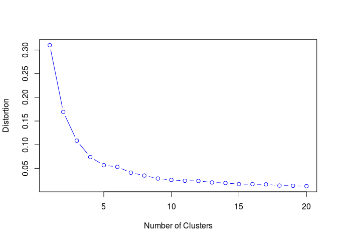

# Crime Clustering in Chicago
Alan Zablocki  
August 3, 2016  


## Setup

We load the required libraries.

```r
library(raster)
```

```
## Loading required package: sp
```

```r
library(sp)
library(maptools)
```

```
## Checking rgeos availability: FALSE
##  	Note: when rgeos is not available, polygon geometry 	computations in maptools depend on gpclib,
##  	which has a restricted licence. It is disabled by default;
##  	to enable gpclib, type gpclibPermit()
```

```r
gpclibPermit()
```

```
## [1] FALSE
```

```r
library(maptools)
library(mapdata)
```

```
## Loading required package: maps
```

```r
library(ggmap)
```

```
## Loading required package: ggplot2
```

```r
library(ggplot2)
library(geosphere)
library(maps)
library(animation)
```
Load the theft data for Chicago

```r
mydata  = read.csv("Chicago_crimes_2008_somethefts_only_HP.csv")
head(mydata)
```

```
##                     Date IUCR Primary.Type    Description
## 1 01/12/2015 05:30:00 PM  820        THEFT $500 AND UNDER
## 2 01/12/2015 05:00:00 PM  820        THEFT $500 AND UNDER
## 3 01/12/2015 04:00:00 PM  810        THEFT      OVER $500
## 4 01/12/2015 03:00:00 PM  820        THEFT $500 AND UNDER
## 5 01/12/2015 10:30:00 AM  820        THEFT $500 AND UNDER
## 6 01/12/2015 10:30:00 AM  820        THEFT $500 AND UNDER
##        Location.Description X.Coordinate Y.Coordinate Year Latitude
## 1                    STREET      1183686      1873324 2015 41.80759
## 2                    STREET      1187977      1861520 2015 41.77510
## 3 SCHOOL, PRIVATE, BUILDING      1177517      1872030 2015 41.80418
## 4                    STREET      1180288      1876790 2015 41.81718
## 5                 APARTMENT      1178785      1876973 2015 41.81771
## 6                    STREET      1179760      1874025 2015 41.80960
##   Longitude
## 1 -87.60181
## 2 -87.58645
## 3 -87.62447
## 4 -87.61417
## 5 -87.61967
## 6 -87.61619
```
Select only relevant columns

```r
mydata <- mydata[,c(2,3,5,8,9,10)]
colnames(mydata) <- c("iucr","offense","locat","year","lati","long")
```
Subset data, include street theft only

```r
mydata_STREET_THEFT <- mydata[mydata$locat == "STREET", ]
```
Remove any NAs

```r
mydata_cleaned <- na.omit(mydata_STREET_THEFT)
```
Select 2014 as an example

```r
theft14 <- mydata_cleaned[mydata_cleaned$year == "2014", ]
head(theft14)
```

```
##    iucr offense  locat year     lati      long
## 54  820   THEFT STREET 2014 41.77456 -87.60691
## 55  820   THEFT STREET 2014 41.77623 -87.59747
## 62  820   THEFT STREET 2014 41.80746 -87.61371
## 64  810   THEFT STREET 2014 41.79507 -87.58239
## 72  820   THEFT STREET 2014 41.79952 -87.58140
## 74  820   THEFT STREET 2014 41.80192 -87.62086
```

```r
dim(theft14)
```

```
## [1] 804   6
```
Find the range for long/lat in this dataset

```r
min(abs(theft14[,6]))
```

```
## [1] 87.57012
```

```r
min(abs(theft14[,5]))
```

```
## [1] 41.77001
```

```r
max(abs(theft14[,6]))
```

```
## [1] 87.62915
```

```r
max(abs(theft14[,5]))
```

```
## [1] 41.81997
```

```r
# Get a map of Chicago with appropriate zoom level
require(ggmap)
map_of_Chicago <- get_map(location = c(long = -87.60, lati = 41.80), zoom = 13, maptype = "roadmap", scale = 2)
```

```
## Map from URL : http://maps.googleapis.com/maps/api/staticmap?center=41.8,-87.6&zoom=13&size=640x640&scale=2&maptype=roadmap&language=en-EN&sensor=false
```
For now we will leave out the highly zoomed in area around the University of Chicago
```r
small_plot <- ggmap(map_of_Chicago, extent = "normal", maprange=FALSE) %+% theft14 + aes(x = long, y = lati) + geom_density2d(aes(x = long, y = lati, fill = ..level.. , alpha = ..level..),bins = 25, colour = "black") + coord_map(projection="mercator", xlim=c(-87.607,-87.585), ylim=c(41.785,41.803)) + guides(fill = FALSE,alpha=FALSE,size=FALSE) + geom_point(aes(x = long, y = lati), size = 1, fill = "red", shape = 21)
small_plot
```
<!-- -->

```r
# Perform k-means clustering on the whole data set.
# Match x and y axis to long / lati
kmeans_data <- theft14[,6:5]
head(kmeans_data)
```

```
##         long     lati
## 54 -87.60691 41.77456
## 55 -87.59747 41.77623
## 62 -87.61371 41.80746
## 64 -87.58239 41.79507
## 72 -87.58140 41.79952
## 74 -87.62086 41.80192
```

```r
# Find an appropriate number of clusters based on 'elbow' plot
crime0 <- na.omit(kmeans_data)
crime <- data.matrix(crime0)
str(crime)
```

```
##  num [1:804, 1:2] -87.6 -87.6 -87.6 -87.6 -87.6 ...
##  - attr(*, "dimnames")=List of 2
##   ..$ : chr [1:804] "54" "55" "62" "64" ...
##   ..$ : chr [1:2] "long" "lati"
```

```r
cl <- kmeans(crime,5)
class(cl)
```

```
## [1] "kmeans"
```

```r
str(cl)
```

```
## List of 9
##  $ cluster     : Named int [1:804] 4 3 5 2 2 5 4 3 1 4 ...
##   ..- attr(*, "names")= chr [1:804] "54" "55" "62" "64" ...
##  $ centers     : num [1:5, 1:2] -87.6 -87.6 -87.6 -87.6 -87.6 ...
##   ..- attr(*, "dimnames")=List of 2
##   .. ..$ : chr [1:5] "1" "2" "3" "4" ...
##   .. ..$ : chr [1:2] "long" "lati"
##  $ totss       : num 0.31
##  $ withinss    : num [1:5] 0.00924 0.00465 0.01126 0.01851 0.01298
##  $ tot.withinss: num 0.0566
##  $ betweenss   : num 0.254
##  $ size        : int [1:5] 172 111 141 190 190
##  $ iter        : int 4
##  $ ifault      : int 0
##  - attr(*, "class")= chr "kmeans"
```

```r
# helper functions to get the 'elbow' plot
kmeans.wss.k <- function(crime, k){
  km = kmeans(crime, k)
  return (km$tot.withinss)
}
kmeans.dis <- function(crime, maxk){
  dis=(nrow(crime)-1)*sum(apply(crime,2,var))
  dis[2:maxk]=sapply (2:maxk, kmeans.wss.k, crime=crime)
  return(dis)
}
```
<!-- -->

```
## NULL
```

```r
# Seems like 10 clusters should do it. Let's animate this.
# animation is nice, but takes up a lot of the write up
#cl<- kmeans.ani(kmeans_data, 10)
```

```r
#Examine the cluster plot
#fit1 <- kmeans(crime,10)
#mydata1 <- data.frame(mydata,fit1$cluster)
#aggregate(crime,by=list(fit1$cluster),FUN=mean)
#clusplot(mydata1,fit1$cluster, color = TRUE, shade = TRUE, labels = 2, lines=0)
```

```r
# set random seed for reproducing results
# plotting clustered data coloured by cluster solution using k-means
set.seed(1234)
dfX <- data.frame(long=theft14$long,lati=theft14$lati)
km <- kmeans(dfX,centers=10)
kmc <- data.frame(long=km$centers[,1],lati=km$centers[,2])
dfX$clust <- km$cluster
ggmap(map_of_Chicago, extent = "normal", maprange=FALSE) %+% theft14 + aes(x = long, y = lati) + geom_density2d(aes(x = long, y = lati, fill = ..level.. , alpha = ..level..),bins = 25, colour = "black") + coord_map(projection="mercator", xlim=c(-87.63,-87.57), ylim=c(41.77,41.82)) + guides(fill = FALSE,alpha=FALSE,size=FALSE) + geom_point(aes(x = long, y = lati), size = 2, fill = "red", shape = 21) + geom_point(data=dfX, aes(x=long, y=lati, color=factor(clust)), size=2) + geom_point(data=kmc, aes(x=long, y=lati), size=2)
```

<!-- -->

```r
# What if we perform the clustering on distances instead of latitude/longitude pairs?

# helper function

geo.dist = function(df) {
  require(geosphere)
  d <- function(i,z){         # z[1:2] contain long, lat
    dist <- rep(0,nrow(z))
    dist[i:nrow(z)] <- distHaversine(z[i:nrow(z),1:2],z[i,1:2])
    return(dist)
  }
  dm <- do.call(cbind,lapply(1:nrow(df),d,df))
  return(as.dist(dm))
}

df_lat <- data.frame(long=theft14$long,lati=theft14$lati)
df_dist <- geo.dist(df_lat)
set.seed(1234)
km_dist <- kmeans(df_dist,centers = 10)
set.seed(1234)
km_lat <- kmeans(df_lat,centers = 10)
df_with_dist <- data.frame(long=theft14$long,lati=theft14$lati)
df_lat$clust <- km_lat$cluster
df_with_dist$clust <- km_dist$cluster
kmc_lat <- data.frame(long=km_lat$centers[,1],lati=km_lat$centers[,2])
kmc_dist <- data.frame(long=km_dist$centers[,1],lati=km_dist$centers[,2])
# solution based on distances
ggmap(map_of_Chicago, extent = "normal", maprange=FALSE) %+% theft14 + aes(x = long, y = lati) + geom_point(data=df_with_dist, aes(x=long, y=lati, color=factor(clust)), size=3) + geom_point(aes(x = long, y = lati), size = 1, fill = "red", shape = 21) + coord_map(projection="mercator", xlim=c(-87.63,-87.57), ylim=c(41.77,41.82))
```

<!-- -->

```r
# solution based on long/lat pairs with cluster centres in black
ggmap(map_of_Chicago, extent = "normal", maprange=FALSE) %+% theft14 + aes(x = long, y = lati) + geom_point(data=df_lat, aes(x=long, y=lati, color=factor(clust)), size=3) + geom_point(aes(x = long, y = lati), size = 1, fill = "red", shape = 21) + geom_point(data=kmc_lat, aes(x=long, y=lati), size=2, fill="black") + coord_map(projection="mercator", xlim=c(-87.63,-87.57), ylim=c(41.77,41.82))
```

<!-- -->

Performing k-means on crime data with longitude and latitude gives similar results to when we run k-means on distances, but some of the data is assigned to different clusters. 

Although, 10 clusters seems like enough, in reality we do care about a maximum distance that a cluster will cover. In the map, we see that each cluster covers a number of blocks, which is not ideal. 

The next steps are:

1 - Increase the number of clusters in k-means to cover smaller areas
2 - Perform hierarchical clustering and invetigate a useful upper bound for a cluster
3 - Look at different clustering methods like dbscan, pam, clara and their possible application to this problem.
4 - Analyze clusters for smaller area, immediately surrounding the HP UofC campus


```r
# hierarchial clustering with a cut-off at 10
set.seed(1234)
dfX2 <- data.frame(long=theft14$long,lati=theft14$lati)
d <- geo.dist(dfX2)
hc <- hclust(d)
plot(hc) # plot dendrogram
```

<!-- -->

```r
dfX2$clust <- cutree(hc,k=10)
ggmap(map_of_Chicago, extent = "normal", maprange=FALSE) %+% theft14 + aes(x = long, y = lati) + geom_point(data=dfX2, aes(x=long, y=lati, color=factor(clust)), size=3) + geom_point(aes(x = long, y = lati), size = 1, fill = "red", shape = 21) + coord_map(projection="mercator", xlim=c(-87.63,-87.57), ylim=c(41.77,41.82))
```

<!-- -->


```r
# hierarchial clustering with a cut-off at 40
set.seed(1234)
dfX2 <- data.frame(long=theft14$long,lati=theft14$lati)
d <- geo.dist(dfX2)
hc <- hclust(d)
plot(hc) # plot dendrogram
```

<!-- -->

```r
dfX2$clust <- cutree(hc,k=40)
ggmap(map_of_Chicago, extent = "normal", maprange=FALSE) %+% theft14 + aes(x = long, y = lati) + geom_point(data=dfX2, aes(x=long, y=lati, color=factor(clust)), size=3) + geom_point(aes(x = long, y = lati), size = 1, fill = "red", shape = 21) + coord_map(projection="mercator", xlim=c(-87.63,-87.57), ylim=c(41.77,41.82))
```

<!-- -->
How does k-means perform for 40 clusters?

```r
set.seed(1234)
dfX <- data.frame(long=theft14$long,lati=theft14$lati)
km <- kmeans(dfX,centers=40)
kmc <- data.frame(long=km$centers[,1],lati=km$centers[,2])
dfX$clust <- km$cluster
ggmap(map_of_Chicago, extent = "normal", maprange=FALSE) %+% theft14 + aes(x = long, y = lati) + coord_map(projection="mercator", xlim=c(-87.63,-87.57), ylim=c(41.77,41.82)) + guides(fill = FALSE,alpha=FALSE,size=FALSE) + geom_point(data=dfX, aes(x=long, y=lati, color=factor(clust)), size=2) + geom_point(data=kmc, aes(x=long, y=lati), size=2)
```

<!-- -->
We end with a coloured heat map with cluster solution using k-means with k=10.

```r
ggmap(map_of_Chicago, extent = "normal", maprange=FALSE) %+% theft14 + aes(x = long, y = lati) + stat_density2d(aes(fill = ..level.., alpha = ..level..),size = 2, bins = 25, geom = 'polygon') + geom_density2d(aes(x = long, y = lati, fill = ..level.. , alpha = ..level..),bins = 25, colour = "black") + scale_fill_gradient(low = "green", high = "red") + scale_alpha(range = c(0.0, 0.25), guide = FALSE) + coord_map(projection="mercator", xlim=c(-87.63,-87.57), ylim=c(41.77,41.82)) + guides(fill = guide_colorbar(barwidth = 1.5, barheight = 10)) + geom_point(data=df_lat, aes(x=long, y=lati, color=factor(clust)), size=1) +geom_point(data=kmc_lat, aes(x=long, y=lati), size=1, fill="black")
```

<!-- -->
